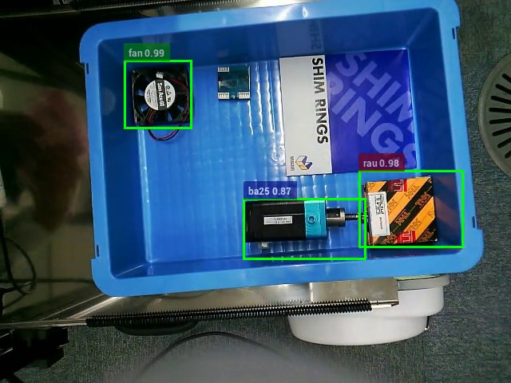

# jsk teaching object package

This package provides a simple human teachable function for the robot to recognize objects.

## Install

```
mkdir -p ~/jsk_teaching_object/src
cd ~/jsk_teaching_object/src
wstool init
wstool merge https://raw.githubusercontent.com/iory/jsk_demos/teaching-object/jsk_teaching_object/noetic.rosinstall
wstool update
cd ../
source /opt/ros/noetic/setup.bash
rosdep update
rosdep install -y -r --from-paths src --ignore-src
catkin build jsk_teaching_object
source devel/setup.bash
```


## Training

comming soon.

## Run trained models.

```
roslaunch jsk_teaching_object edgetpu_detection.launch INPUT_IMAGE:=/openni_camera/rgb/image_raw \
    model_file:=<MODEL_PATH> \
    label_file:=<LABEL_FILE_PATH>
```

## Run sample trained models.

```
roslaunch jsk_teaching_object sample_edgetpu_detection_with_depth_filter.launch
```


### for industry

```
roslaunch jsk_teaching_object sample_object_detection.launch gui:=true
```




